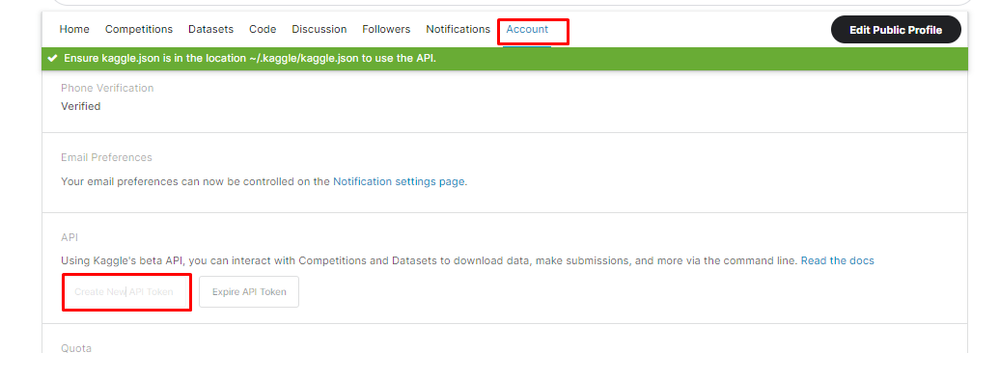

# proyecto_ia_five_personalities
This is a repository for hosting the project of the subject "Artificial Intelligence for Sciences and Engineerings" of Univerity of Antioquia.

Integrantes de grupo:

*Daniel Alexander Basto Moreno – CC. 1030639051 - Bioingenieria
*Kevin Alonso Restrepo García – CC.1216726638 - Ingenieria de Sistemas
*Angie Viviana Rosales Portilla – CC. 1037661697 - Bioingenieria

Recursos:
- Dataset de Kaggle: https://www.kaggle.com/datasets/tunguz/big-five-personality-test

# Indicaciones para reproducir el Notebook

- Se debe generar un API_TOKEN desde una cuenta validad en Kaggle:

- Al generar el API_TOKEN este descarga un archivo "kaggle.json" este se debe cargar en el Notebook en la ruta raíz.

# URL del video correspondiente a la entrega N° 2

-URL: ![Video]https://www.youtube.com/watch?v=LBp90gF-XgY&feature=youtu.be